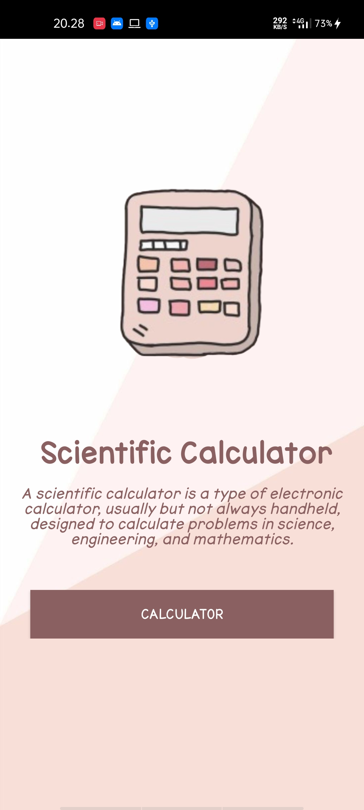
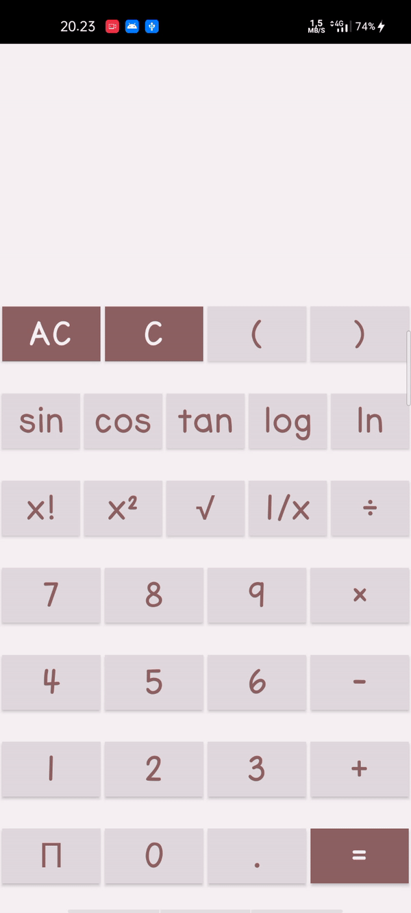

# CalculatorScientific

Kalkulator scientific atau kalkulator ilmiah yaitu jenis kalkulator elektronik, biasanya tetapi tidak selalu genggam, dirancang untuk menghitung masalah dalam sains, teknik, dan matematika. Mereka telah sepenuhnya menggantikan aturan slide dalam aplikasi tradisional, dan banyak digunakan dalam pengaturan pendidikan dan profesional.

Masuk aplikasi

Proses aplikasi

Terdiri dari dua halaman yaitu :

Tampilan halaman saat awal masuk

Tampilan halaman kalkulator

proses kalkulator 

